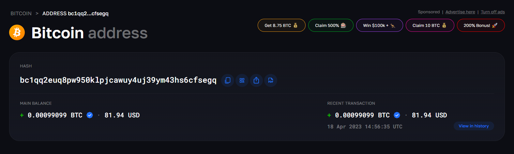
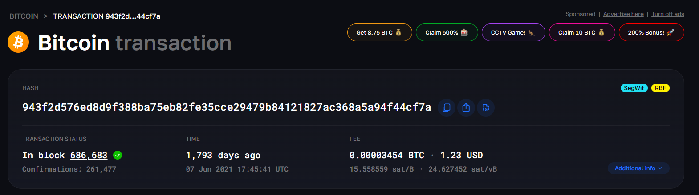
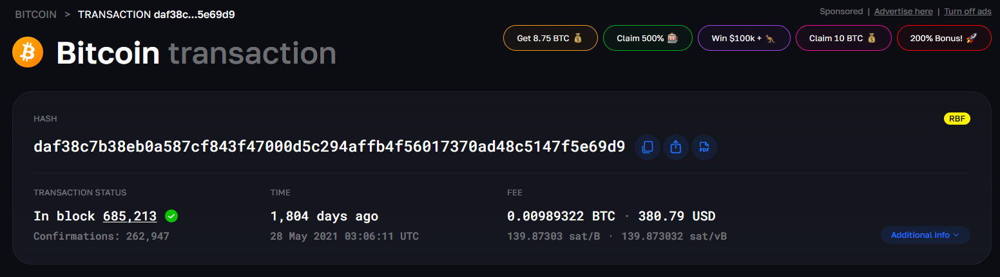

# Case Investigation: Colonial Pipeline / DarkSide Bitcoin Ransom

*Written analysis of a publicly documented case, based on blockchain records and published investigative sources.*

## 1. Investigation Objective

I analyzed publicly available blockchain data related to the Colonial Pipeline ransomware attack, traced Bitcoin transactions associated with the ransom payment, and compared the blockchain observations with official statements from the U.S. Department of Justice (DOJ). I also documented the limits of what public blockchain evidence can establish on its own.

## 2. Tools and Resources Used

- DOJ Press Release
- DOJ Affidavit
- Elliptic Analysis
- Blockchair Bitcoin Explorer

## 3. Verified Case Facts

The Colonial Pipeline ransomware attack was carried out by the DarkSide group. The company paid approximately 75 BTC as ransom after its systems were compromised. On 7 June 2021, the DOJ announced that it had seized approximately 63.7 BTC linked to the attack. Law enforcement tracked the ransom through the public Bitcoin blockchain and identified a Bitcoin address holding the funds. The DOJ confirmed that the FBI had access to the private key. The seizure represented a large portion of the ransom, but not the full amount.

## 4. Subject Address Investigated

**Bitcoin Address:** `bc1qq2euq8pw950klpjcawuy4uj39ym43hs6cfsegq`

I verified the subject address using a blockchain explorer (see Figure 1).

**Source:** Elliptic analysis



*Figure 1: Subject Bitcoin address page (Blockchair).*

## 5. Glossary

| Term | Explanation | Source |
|---|---|---|
| Bitcoin | A decentralized digital currency used for transactions | DOJ Affidavit |
| Bitcoin Address | A unique identifier used to send and receive Bitcoin | DOJ Affidavit |
| Private Key | Secret material that allows control of Bitcoin funds | DOJ Affidavit |
| Wallet | Software or a system used to manage Bitcoin keys | DOJ Affidavit |
| Blockchain | Public ledger recording Bitcoin transactions | DOJ Affidavit |
| Blockchain Explorer | Tool used to view and analyze blockchain data | DOJ Affidavit |

## 6. Transaction History

| Direction | Amount (BTC) | Date/Time (UTC) | Transaction Hash |
|---|---:|---|---|
| Received | 69.60422177 | 28 May 2021 03:06:11 | `daf38c7b38eb0a587cf843f47000d5c294affb4f56017370ad48c5147f5e69d9` |
| Sent | 69.60422177 | 07 Jun 2021 17:45:41 | `943f2d576ed8d9f388ba75eb82fe35cce29479b84121827ac368a5a94f44cf7a` |
| Received | 5.90422177 | 07 Jun 2021 17:45:41 | `943f2d576ed8d9f388ba75eb82fe35cce29479b84121827ac368a5a94f44cf7a` |
| Sent | 5.90422177 | 07 Jun 2021 17:53:24 | `280c5f96397b9502b99703842712b78fda84f1a0faabf826f683448082f46369` |
| Received | 0.00099099 | 18 Apr 2023 14:56:35 | `4a064218c7e699e34c2d4cdf29823d7dc85b756aa0792555771be8d9d1266028` |

## 7. Comparison with DOJ Affidavit

| DOJ Statement | Explorer Observation | Conclusion |
|---|---|---|
| ~75 BTC ransom paid | Multiple transactions totaling ~75 BTC | Matches |
| Funds moved through multiple addresses | Indirect transfers visible | Matches |
| 69.60422177 BTC reached subject address | Exact amount observed on 28 May | Matches |
| FBI had private key | Not visible on blockchain | Requires external confirmation |

## 8. 7 June 2021 Transaction Analysis

| Field | Details |
|---|---|
| Transaction Hash | `943f2d576ed8d9f388ba75eb82fe35cce29479b84121827ac368a5a94f44cf7a` |
| Date/Time | 07 June 2021 17:45:41 UTC |
| Input | 69.60422177 BTC |
| Output to subject address | 5.90422177 BTC |
| Sent Amount | 69.60422177 BTC |
| Fee | See Blockchair screenshot |

The transaction details are shown in Blockchair (see Figure 2).



*Figure 2: Blockchair record of the 7 June 2021 transaction.*

**Observation:** the transaction shows both outgoing and incoming funds, indicating internal redistribution or controlled movement.

## 9. Why the Seized Amount Was Not 75 BTC

The total ransom paid was approximately 75 BTC. DarkSide operated under a Ransomware-as-a-Service model in which proceeds were split between affiliates and developers. According to Elliptic, approximately 85% (~63.75 BTC) went to the affiliate and 15% went to the developers. The DOJ seized approximately 63.7 BTC, which is consistent with the affiliate's share rather than the full ransom amount.

## 10. Confirmed Facts

| Confirmed Fact | Source | Notes |
|---|---|---|
| ~75 BTC ransom paid | DOJ | Approximate |
| ~63.7 BTC seized | DOJ | Confirmed |
| Subject address exists | Blockchair | Verified |
| Transactions recorded publicly | Blockchain | Verifiable |
| FBI had private key | DOJ | External confirmation |

## 11. Limitations

| Potential Overclaim | Why I Would Not Make It |
|---|---|
| Identifying wallet owner | Blockchain data does not reveal the real-world identity by itself |
| Assuming attacker identity | Requires external intelligence and attribution evidence |
| Full ransom recovered | Only a partial seizure was confirmed |
| Proving control of funds | The FBI's access to the private key comes from DOJ reporting, not the blockchain itself |

## 12. Fund Flow

```text
Colonial Pipeline (Victim)
        ↓ (~75 BTC)
DarkSide Wallets (Multiple Transfers)
        ↓
Intermediate Addresses
        ↓ (69.60422177 BTC on 28 May 2021)
Subject Address
        ↓ (7 June 2021 movement)
Law Enforcement Seizure (~63.7 BTC)
```

## 13. Conclusion

I found that public blockchain data provides a useful way to trace cryptocurrency movement, but it does not independently identify the people controlling an address. The transaction history I examined aligns with the DOJ's published account of the ransom movement, while the seizure itself depended on information outside the blockchain, including FBI access to the private key. This case shows why blockchain analysis is most useful when combined with traditional investigative evidence.

## 14. Screenshots

- Figure 1: Subject Bitcoin Address Page (Blockchair)
- Figure 2: 7 June 2021 Transaction Analysis
- Figure 3: 28 May 2021 Incoming Transaction



*Figure 3: Blockchair record of the 28 May 2021 incoming transaction.*

*Accessed on: 6 May 2026*
