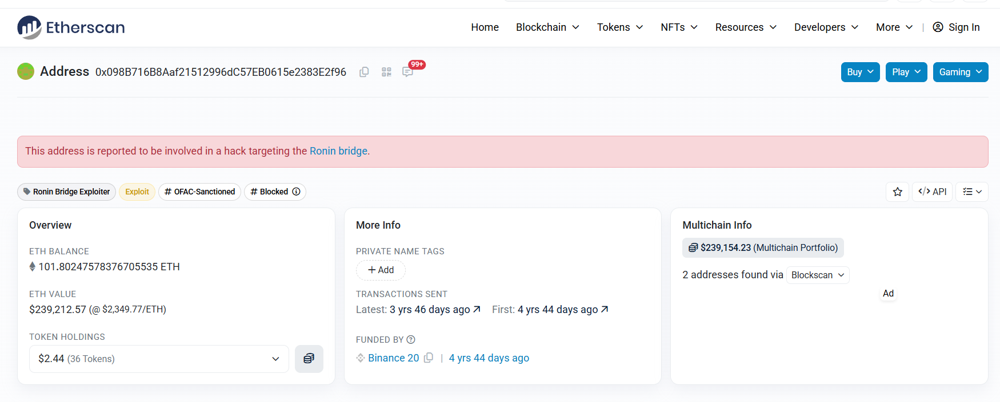
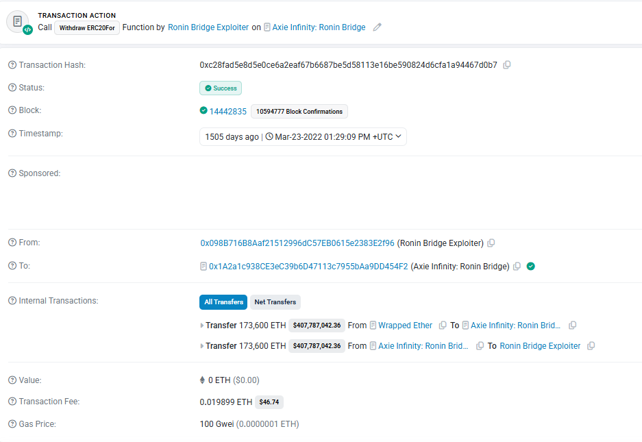
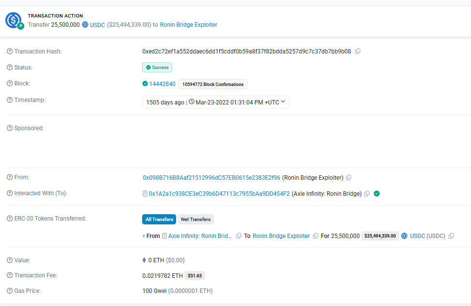
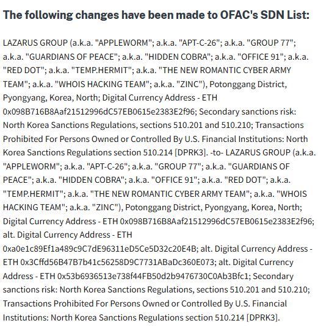

# Case Investigation: Ronin Bridge / Axie Infinity / Lazarus Group Ethereum Investigation

*Written analysis of a publicly documented blockchain incident, based on published investigative sources and blockchain records.*

## 1. Investigation Objective

I analyzed Ethereum blockchain activity related to the Ronin Bridge exploit, examined smart contract interactions, reviewed major transactions involving ETH and USDC, verified sanctions information, and documented the limitations of public blockchain evidence.

## 2. Tools and Resources Used

- Ronin Network Postmortem
- Etherscan Blockchain Explorer
- OFAC Sanctions Page
- U.S. Treasury Tornado Cash Release

## 3. Verified Case Facts

The Ronin Bridge exploit occurred on 23 March 2022 and was discovered on 29 March 2022. The attacker drained 173,600 ETH and 25.5 million USDC. The attack was executed by compromising five of nine validator private keys, allowing forged withdrawal approvals. The exploit was carried out in two major transactions. The address involved is publicly labeled as the Ronin Bridge Exploiter and is sanctioned by OFAC under the Lazarus Group.

## 4. Case Facts

| Fact | Source | Relevance |
|---|---|---|
| Attack date: 23 March 2022 | Ronin Postmortem | Timeline |
| Discovered: 29 March 2022 | Ronin Postmortem | Detection delay |
| 173,600 ETH stolen | Ronin Postmortem | Major loss |
| 25.5M USDC stolen | Ronin Postmortem | Major loss |
| 5/9 validators compromised | Ronin Postmortem | Attack method |
| 2 transactions used | Ronin Postmortem | Execution |

## 5. Address Investigated

**Address:** `0x098B716B8Aaf21512996dC57EB0615e2383E2f96`

- Label: Ronin Bridge Exploiter
- Category: Exploit
- Sanctions: OFAC-Sanctioned

I verified the address and its public label on Etherscan (see Figure 1).



*Figure 1: Etherscan address page, showing the "Ronin Bridge Exploiter," "Exploit," and "OFAC-Sanctioned" labels.*

## 6. Why Current Balance Is Not Reliable

The current balance of an Ethereum address can change over time due to subsequent transactions. It therefore does not represent the original stolen amount. For an investigation, historical transaction data is more useful than the current balance alone.

## 7. ETH Transaction Analysis (173,600 ETH)

| Field | Details |
|---|---|
| Hash | `0xc28fad5e8d5e0ce6a2eaf67b6687be5d58113e16be590824d6cfa1a94467d0b7` |
| Status | Success |
| Time | 23 Mar 2022 01:29:09 UTC |
| From | Exploiter Address |
| To | Ronin Bridge Contract |
| Function | `withdrawERC20For` |
| Internal Transfer | 173,600 ETH |
| Value Field | 0 ETH |
| Fee | 0.019899 ETH |

**Explanation:** this is not a normal direct transfer. It is a smart contract interaction in which the ETH movement appears in internal transactions rather than the main value field. This is why Ethereum investigations require more than checking the top-level transaction value.

The internal transfer of 173,600 ETH is visible on Etherscan (see Figure 2).



*Figure 2: Etherscan transaction record showing the internal transfer of 173,600 ETH from the Ronin Bridge to the Exploiter address.*

## 8. USDC Transaction Analysis (25,500,000 USDC)

| Field | Details |
|---|---|
| Hash | `0xed2c72ef1a552ddaec6dd1f5cddf0b59a8f37f82bdda5257d9c7c37db7bb9b08` |
| Status | Success |
| Time | 23 Mar 2022 01:31:04 UTC |
| From | Exploiter Address |
| Interacted With | Ronin Bridge |
| Token | USDC |
| Amount | 25,500,000 |
| Value Field | 0 ETH |
| Fee | 0.0219782 ETH |

The ERC-20 transfer of 25,500,000 USDC is shown in the token transfer data (see Figure 3).



*Figure 3: Etherscan transaction record showing the ERC-20 transfer of 25,500,000 USDC from the Ronin Bridge to the Exploiter address.*

## 9. ETH vs. USDC

The ETH transaction shows asset movement through internal transactions, while the USDC transfer appears under ERC-20 token transfers. Both transactions show 0 ETH in the top-level value field. This demonstrates why blockchain investigations require examination of contract calls, internal transactions, and token transfers rather than relying on a single transaction field.

## 10. OFAC Sanctions Verification

| Field | Entry |
|---|---|
| Address | `0x098B716B8Aaf21512996dC57EB0615e2383E2f96` |
| Source | OFAC |
| Listed Entity | Lazarus Group |
| Present | Yes |
| Date | 22 April 2022 |

The address is listed under sanctions (see Figure 4).



*Figure 4: OFAC Specially Designated Nationals (SDN) List entry for the Lazarus Group, listing the Ronin Bridge Exploiter address among its associated digital currency addresses.*

## 11. Tornado Cash

A cryptocurrency mixer such as Tornado Cash can make tracing funds more difficult by pooling and redistributing them. It does not erase historical blockchain records, so earlier transactions remain available for analysis.

## 12. Transaction Evidence

| Date | Hash | Asset | Amount | From | To | Source |
|---|---|---|---:|---|---|---|
| 23 Mar 2022 | `c28f...` | ETH | 173,600 | Exploiter | Ronin Bridge | Etherscan |
| 23 Mar 2022 | `ed2c...` | USDC | 25,500,000 | Exploiter | Ronin Bridge | Etherscan |

## 13. Fund Flow

**ETH Flow:**
```text
Compromised Validators → Forged Approval → Ronin Bridge → 173,600 ETH → Exploiter Address
```

**USDC Flow:**
```text
Compromised Validators → Forged Approval → Ronin Bridge → 25.5M USDC → Exploiter Address
```

## 14. Confirmed Facts

| Fact | Source |
|---|---|
| Attack occurred | Ronin |
| ETH stolen | Etherscan |
| USDC stolen | Etherscan |
| Address labeled exploiter | Etherscan |
| Address linked to Lazarus | OFAC |

## 15. Limitations

| Potential Overclaim | What the Evidence Supports |
|---|---|
| Identity proven | Not from blockchain evidence alone |
| Value field shows theft | Internal/ERC-20 data must also be examined |
| Current balance shows original loss | Current balance is not sufficient |
| Mixers remove transaction history | Mixers can obscure fund flows but do not erase earlier records |

## 16. Conclusion

I found that the Ronin Bridge case is a good example of why blockchain investigations require more than basic wallet balances and transaction values. Public blockchain data shows the relevant asset movements, while OFAC and the Ronin postmortem provide additional attribution and incident context. At the same time, blockchain evidence alone cannot independently establish a real-world identity.

## 17. Screenshots

- Figure 1: Etherscan Address Page (Ronin Bridge Exploiter)
- Figure 2: ETH Internal Transfer Transaction
- Figure 3: USDC Transfer Transaction
- Figure 4: OFAC SDN List Entry

*All screenshots were accessed on 6 May 2026 (UTC).*
